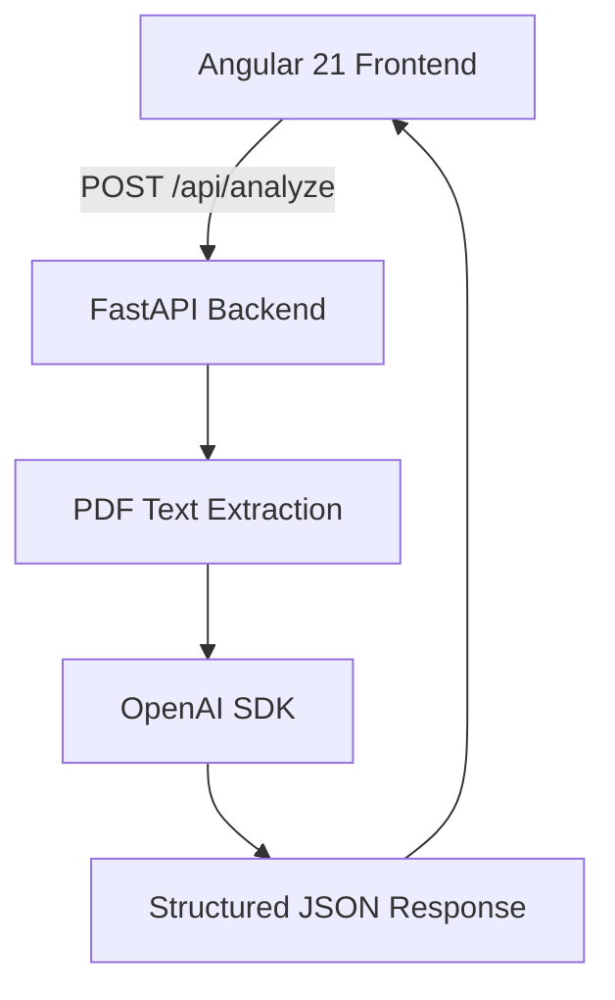

# AI-Powered Resume Analyzer

A simple, beginner-friendly full-stack application that analyzes a resume (PDF) against a job description using AI.

## Features
* Resume PDF upload
* Job description input
* AI-powered ATS compatibility score
* Gap analysis
* Missing skills
* Missing keywords
* Rewrite suggestions
* Browser persistence
* FastAPI backend
* OpenAI SDK integration
* Angular 21 frontend

## Architecture


## Tech Stack
* Angular 21
* Python 3.11+
* FastAPI
* OpenAI SDK
* pypdf
* TypeScript
* HTML/CSS

## Prerequisites
* Node.js
* Angular CLI
* Python 3.11+
* OpenAI API key

## Installation

### Frontend Setup
```bash
cd frontend
npm install
npm start
```

### Backend Setup
```bash
cd backend
python -m venv venv

# Windows
venv\Scripts\activate

# Linux/macOS
source venv/bin/activate

pip install -r requirements.txt
uvicorn app.main:app --reload
```

## Environment Setup
Create a `.env` file in the `backend/` directory (or use the one in root) based on `.env.example`:
```env
OPENAI_API_KEY=your_openai_api_key
OPENAI_MODEL=gpt-4o-mini
ALLOWED_ORIGINS=http://localhost:4200
MAX_FILE_SIZE_MB=5
```

## Usage
1. Start backend (`uvicorn app.main:app --reload`)
2. Start frontend (`npm start` or `ng serve`)
3. Open `http://localhost:4200`
4. Upload your resume PDF and paste a job description.
5. Click **Analyze Resume** to see the results.

## API Documentation
Once the backend is running, you can view the API documentation at:
`http://localhost:8000/docs`

## Persistence Behavior
- **Browser refresh**: Results remain visible. Data is stored locally in the browser (IndexedDB and localStorage). No database is used.
- **Backend restart**: Backend memory is cleared. The server is completely stateless.

## Limitations
- The ATS score is an AI estimate, not an official score from a specific ATS system.
- Different ATS systems use different scoring mechanisms.
- AI analysis is not a guarantee of getting an interview.
- Resume content should be verified by the user.
- API usage may incur OpenAI costs.
